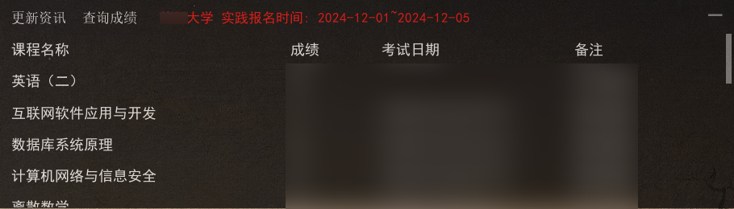

# jiangsu_self-study_exam_info_assistant

江苏自考信息查询助手, 使用 Java 开发, 仅限 Windows 使用.

## 说明

⭐透明桌面UI, 记忆放置位置和大小, 支持置顶显示和开机自启 ;

⭐一键查询江苏省考试官网上有关自考的通知, 防止错过报名和考试时间 ;

⭐每天 `9:00` `~` `21:00` 时段内会每隔3小时自动更新一次资讯 ;

## 用法

解压 `zip` 后, 双击 `ExamInfo_start.bat` 即可运行 ;

查询成绩需要 `右键任务栏图标-设置` 配置 `姓名` 和 `准考证` ;

查询实践报名时间需要 `右键任务栏图标-设置` 配置 `主考学校` ;

## 截图

## License 许可协议

[GPL-3.0 license](https://github.com/echopan/jiangsu_self-study_exam_info_assistant?tab=GPL-3.0-1-ov-file)
